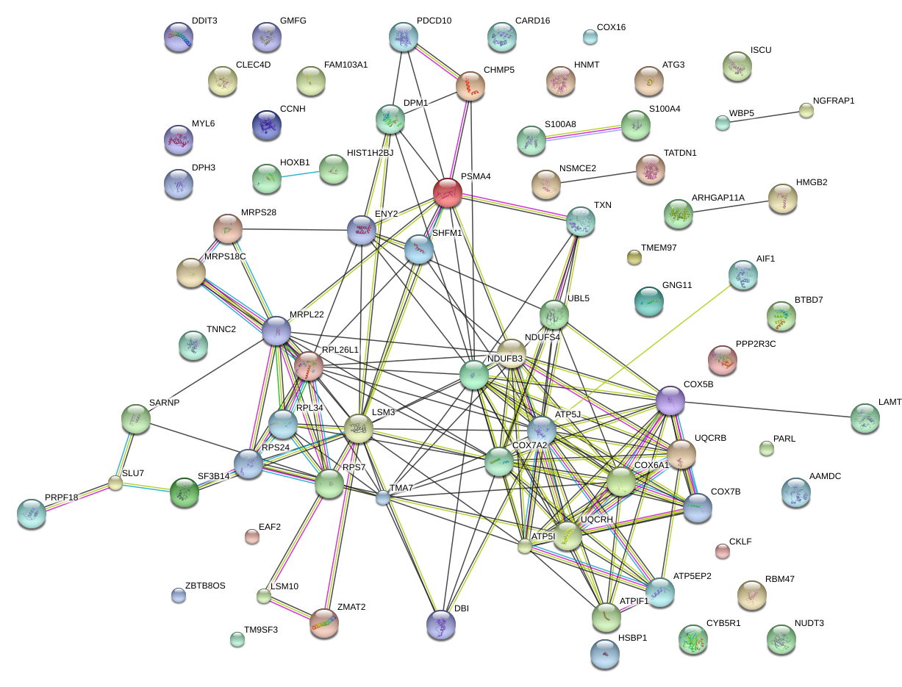
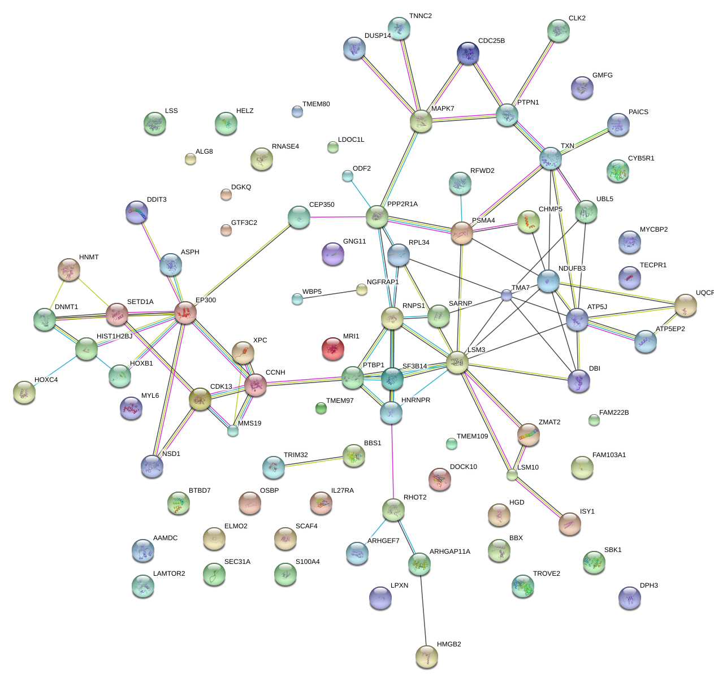

```{r setup, include=FALSE}
knitr::opts_chunk$set(echo = TRUE)
```

# Motivation

This document shows how to use package  [AMOUNTAIN](http://bioconductor.org/packages/release/bioc/html/AMOUNTAIN.html) package step by step. 

# Data preparation

We start by downloading the expression data from GEO database. We use a `GEO2R` style:
```{r,eval=FALSE}
library(Biobase)
library(GEOquery)
library(limma)

# load series and platform data from GEO

gset <- getGEO("GSE25101", GSEMatrix =TRUE, AnnotGPL=TRUE)
if (length(gset) > 1) idx <- grep("GPL6947", attr(gset, "names")) else idx <- 1
gset <- gset[[idx]]

# make proper column names to match toptable 
fvarLabels(gset) <- make.names(fvarLabels(gset))

# group names for all samples
gsms <- "11111111111111110000000000000000"
sml <- c()
for (i in 1:nchar(gsms)) { sml[i] <- substr(gsms,i,i) }

# log2 transform
ex <- exprs(gset)
qx <- as.numeric(quantile(ex, c(0., 0.25, 0.5, 0.75, 0.99, 1.0), na.rm=T))
LogC <- (qx[5] > 100) ||
          (qx[6]-qx[1] > 50 && qx[2] > 0) ||
          (qx[2] > 0 && qx[2] < 1 && qx[4] > 1 && qx[4] < 2)
if (LogC) { ex[which(ex <= 0)] <- NaN
  exprs(gset) <- log2(ex) }
```

The nodes scores are calculated by the expression level, which can be accomplished by the `limma` package.
```{r,eval=FALSE}
# set up the data and proceed with analysis
sml <- paste("G", sml, sep="")    # set group names
fl <- as.factor(sml)
gset$description <- fl
design <- model.matrix(~ description + 0, gset)
colnames(design) <- levels(fl)
fit <- lmFit(gset, design)
cont.matrix <- makeContrasts(G1-G0, levels=design)
fit2 <- contrasts.fit(fit, cont.matrix)
fit2 <- eBayes(fit2, 0.01)

# expression level based node score
z = qnorm(1-fit2$p.value)
tT <- topTable(fit2, adjust="fdr", sort.by="B", number=250)
tT <- subset(tT, select=c("ID","adj.P.Val","P.Value","t","B","logFC","Gene.symbol","Gene.title"))
write.table(tT, file='topTablebyLimma.csv', row.names=F, sep="\t",quote=F)

# used for annotation
tT <- topTable(fit2, adjust="fdr", sort.by="B", number=dim(ex)[1])
tT <- subset(tT, select=c("ID","adj.P.Val","P.Value","t","B","logFC","Gene.symbol","Gene.title"))

# network adjacency matrix
W <- cor(t(ex))
W[W<0] <- 0
```

# Modules identification

As we want to identify multiple modules, we use the module extraction way. We find N modules by running the algorithm N times, with each time simply extracting a module and subsequently delete the module from background network. The module size is constrained around 100.
```{r,eval=FALSE}
library(AMOUNTAIN)
ModulesAmoutain <- function(W,z,lambdav,Nmodule,savefile,minsize,maxsize){
	N = dim(W)[1]
	gNames = as.character(1:N)
	for (ii in 1:Nmodule) {
		abegin = 0.01
		aend = 0.9
		# size control
		for (i in 1:20) {
			x <- CGPFixSS(W,z,a=(abegin+aend)/2,lambda = lambdav,maxiter=50)
			predictedid <- which(x[[2]]!=0)
			if(length(predictedid) > maxsize){
				abegin = (abegin+aend)/2
			}else if (length(predictedid) < minsize){
				aend = (abegin+aend)/2
			}else
				break
		}

			modulescore = sum(W[predictedid,predictedid])+lambdav*sum(z[predictedid])
			tmpstr = gNames[predictedid]
			cp = c()
			for (j in 1:length(tmpstr)){
				cp = paste(cp,tmpstr[j],sep='\t')
			}
			write(paste(modulescore,cp,sep=''),file = savefile,append = TRUE)
		
		W = W[-predictedid,-predictedid]
		z = z[-predictedid]
		gNames = gNames[-predictedid]
		N = dim(W)[1]
		print(paste('Finishing module ',ii,sep=''))
		if(N < 100 | sum(W)==0)
			break
	}
}
savefile = 'AMOUNTAINfixed100.txt'
ModulesAmoutain(W,z,1,100,savefile,100,100)
```

# Enrichment analysis
Functional enrichment analysis is not included in the package `AMOUNTAIN`, but works as an important component of network analysis. In order to check whether there are more known interactions in the modules, we use the resources from the STRING databases. The `STRINGdb` package makes it easy to access results programmatically.
```{r,eval=FALSE}
fhead = '50500'
dir.create(fhead, showWarnings = TRUE, recursive = FALSE, mode = "0777")
rlines=readLines(savefile)
modsize = c()

library(STRINGdb)
string_db <- STRINGdb$new( version="10", species=9606,
score_threshold=0, input_directory="" )
moduleppiscore=matrix(0,nrow=length(rlines),ncol=2)

for (i in 1:length(rlines)) {
	# save the modules gene lists
	ap=strsplit(rlines[i],'\t')[[1]]
 	modscore = c(modscore,ap[1])
 	ap=as.numeric(ap[2:length(ap)])
 	modsize = c(modsize,length(ap))
 	probeid = rownames(ex)[ap]
 	midx <- match(probeid,maptable[,1])
 	entrizd = maptable[midx,2]
 	gsymbol = maptable[midx,3]

 	write(paste('Module',i,sep=' '),
 		file=paste(fhead,"/modulegenes.txt",sep=''),append = TRUE)
 	write(paste('probe id','gene symbol',sep=' '),
  		file=paste(fhead,"/modulegenes.txt",sep=''),append = TRUE)
 	write.table(data.frame(probeid,gsymbol), 
  		file=paste(fhead,"/modulegenes.txt",sep=''),
  		sep='\t',col.names = F,row.names= F,quote=F,append = TRUE)
 	writeLines(as.character(probeid), paste(fhead,"/modulegenesprobe-2h-",i,".txt",sep=''))
 	mgenes <- as.character(gsymbol[!is.na(gsymbol)])
 	writeLines(as.character(gsymbol[!is.na(gsymbol)]), paste(fhead,"/modulegenessymbol-2h-",i,".txt",sep=''))

 	# access STRING
 	diff_exp_genes <- data.frame(mgenes,mgenes)
	colnames(diff_exp_genes)<-c('gene','backup')
	genes_mapped <- string_db$map(diff_exp_genes, "gene", removeUnmappedRows = TRUE )
	hits <- genes_mapped$STRING_id
	ppiscore <- string_db$get_ppi_enrichment(hits)$enrichment
	moduleppiscore[i,1]=ppiscore
	er <- string_db$get_enrichment(hits)
	er<-er[which(er$pvalue_fdr<0.05),]
	moduleppiscore[i,2]=dim(er)[1]
	if (dim(er)[1] > 0){
		write.xlsx(x = er, file = paste(fhead,"/Enrichment.xlsx",sep=''),append = TRUE,
    	sheetName = paste('module',i,sep=''), row.names = FALSE, col.names=TRUE)
	}
	print(paste("Finishing ",i,sep=''))

}
write.table(modsize,file=paste(fhead,"/modsize.txt",sep=''),row.names=F,col.names=F,quote=F)
colnames(moduleppiscore)=c('ppi enrichment pvalue','significantly enriched items')
write.table(moduleppiscore,file=paste(fhead,"/ppienrichmentstats.txt",sep=''),
  quote=F,row.names=F,col.names=F,sep=' ')
length(which(moduleppiscore[,1]<0.05))
```

From the statistics we can see that 49 out of 100 modules have PPI enrichment p-value < 0.05, and 58 out of 100 modules are enriched by at least one GO category with FDR p-value lower than 0.05. The details of enrichment results are stored at [Enrichment.xlsx](http://www.cs.bham.ac.uk/~dxl466/st/Enrichment.xlsx).
We can see that module #19 are enriched by "GO:0045061, thymic T cell selection" and "GO:0033077, T cell differentiation in thymus", listed as Table 3 in the original study. Quite a few modules are enriched by immune-associated pathways, such as module #61, #63, #69 and module #61 are enriched by "GO:0002683 negative regulation of immune system proces", which are consistent with the conclusion from the original study. Moreover, the modules provide a straightforward way to see the interactions of genes. The following figure shows module #61 according to STRING:


Figure 1: Module 61 identified from weighted co-expression network (GSE25101), plotted by STRING, where edges represent the known interactions including curated databases and experimentally determined and predicted interactions such as gene neighborhood and gene co-occurrence. Colored nodes standard for query proteins and first shell of interactors, and white nodes for second shell of interactors.

## Comparison with DEGs

Note the first identified module has 100 probes and 90 valid official gene symbols, 30 of which are listed in the top 100 differentially expressed genes. We compare the two gene lists by looking at the interactions and enriched biological functions:

Figure 2: Module 1 identified from weighted co-expression network (GSE25101), plotted by STRING. PPI enrichment p-value:	0. Enriched Molecular Function: GO:0015078, hydrogen ion transmembrane transporter activity FDR 9.37e-06.


Figure 3: Genes from top 100 differentially expressed genes, plotted by STRING. PPI enrichment p-value: 5.13e-08. Enriched Molecular Function: GO:000372, RNA binding FDR 7.42e-03.

In addition, there are 8 KEGG pathways are enriched by the first module with FDR<0.05, but none was found in the top 100 DEGs.

|KEGG Pathwayspathway ID|pathway description|count in gene set|	false discovery rate|
|-----+--------------+-----------------+---------|
|00190|	Oxidative phosphorylation|	9|	3.23e-07|
|05012|	Parkinson s disease|	8|	6.12e-06|
|04932|	Non-alcoholic fatty liver disease (NAFLD)|	8|	6.31e-06|
|05010|	Alzheimer s disease	|8|	1.1e-05|
|05016|	Huntington s disease	|8|	1.88e-05|
|03010|	Ribosome	|6|	0.000335|
|04260|	Cardiac muscle contraction	|5|	0.000335|
|03040|	Spliceosome	|4|	0.0402|
Table 1: KEGG pathways enriched by Module 1 identified from weighted co-expression network (GSE25101).

# Endnote

Additional files:
[modulegenes.txt](http://www.cs.bham.ac.uk/~dxl466/st/AMOUNTAIN/modulegenes.txt)

Details of enrichment results: [Enrichment.xlsx](http://www.cs.bham.ac.uk/~dxl466/st/AMOUNTAIN/Enrichment.xlsx)

All source code:
[useAMOUNTAIN.R](http://www.cs.bham.ac.uk/~dxl466/st/AMOUNTAIN/useAMOUNTAIN.R)


<!--Finally, if we need to visualize certain modules, package `igraph` can be useful. Here is an [exmaple](http://www.cs.bham.ac.uk/~dxl466/st/netvis/netvis.html) how to plot weighted networks.-->
