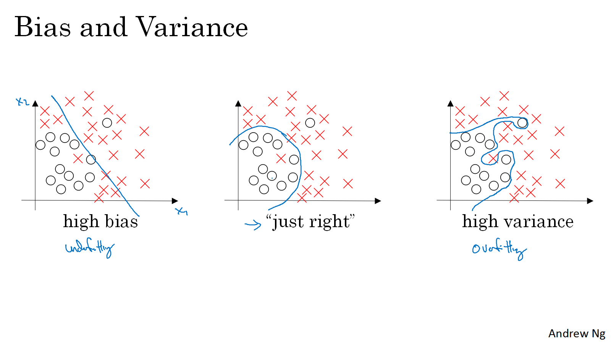
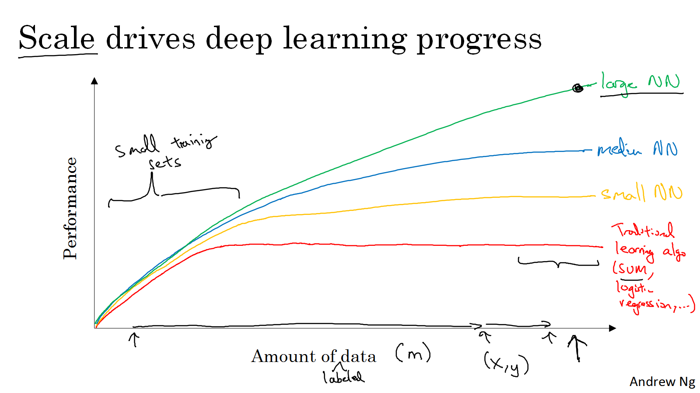
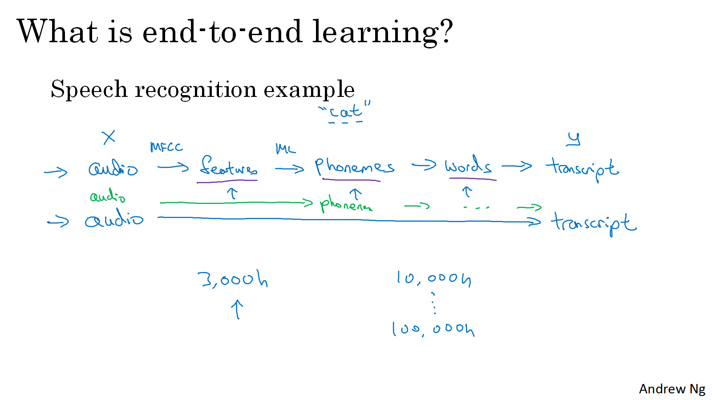
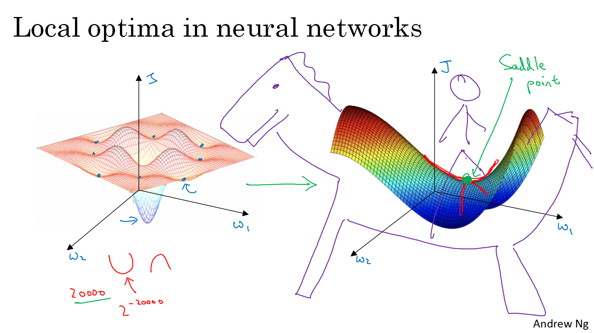

```{r setup, include=FALSE}
knitr::opts_chunk$set(echo = TRUE)

```
# Motivation

Deep learning (DL) has been a hot topic for a while. People tend to categorize it as a small (maybe not that small) branch of machine learning (ML), as a special form mostly based on neural networks (NN). But besides of the notable deep architectures that DL uses, what else has DL brought to ML? Or what are the essential differences between DL and traditional ML?

To answer this question, we may trace back to the origins of ML. Note that we can also trace back to the origins of neural networks as an excited story, from which we can see how neural networks evolved into the current forms step by step. But the clue of ML makes it easier to understand why we need DL. In addition the conceptual exploration, we also cover some high-level facts in the technical aspect on how DL is different from traditional ML. This post is directly inspired by the [Deep Learning Specification](https://www.coursera.org/specializations/deep-learning) I took in the past several months, thank Coursera for providing the financial aid.

# The Conceptual part

A [traditional definition](http://www.cs.cmu.edu/~tom/mlbook.html) of ML requires a ML system (or algorithm) could learn from experience E (mostly data) on certain task T, and the ability of learning is measured by performance P. Learning from data is another expression of a ML algorithm. Different tasks in ML include supervised learning (classification, regression), unsupervised learning (clustering) or reinforcement learning. The experience and performance measures vary on different tasks. 

The performance of a ML algorithm can be measured directly on experience (the training set), but we care more about its ability to predict the unseen data (testing set), which is referred as generalization. For example, in supervised learning, training set comes with labeled data, but we hope the ML system could do as well on test set as possible. The so-called generalization ability is the real concern of a ML system. The traditional learning theory may tell you that simple ML models may underfit the data, which introduce high bias in testing stage. On the contrary, too complicated models may overfit the data, which introduce high variance. Neither high bias nor variance is expected, we need just right -- something between two cases. The following figure illustrates an example.



The model capacity is expected to capture the complexity of the data. If the model capacity is too high, overfitting occurs. ML has been struggling against overfitting for years, since people seem to worry more about applying too complicated algorithms on simple data, compared with applying too simple algorithms on complex data. Some useful techniques such as data augmentation, cross-validation and regularization have been developed to avoid overfitting.

But what if the data are actually far more complex than expected? We are said in the big data era, when the data are explosively generated every day. How should ML evolve to handle with big data?

> Big data requires a set of techniques and technologies with new forms of integration to reveal insights from datasets that are diverse, complex, and of a massive scale.

Another thing is that the performance of traditional ML models would not increase along with the amount of data. But with a large neural network, one may observe the performance increase as expected as the following figure shows. Therefore, both data volume and complexity we have nowadays ask for more complicated ML models, DL has been taking off.



# The Technical part

[Another not too old article](https://homes.cs.washington.edu/~pedrod/papers/cacm12.pdf ) formulates ML as a combination of three components: representation, evaluation and optimization. Almost on each component, DL has made significant differences compared with traditional ML.

## Representation
In order to let computer to deal with data, the data should be represented as certain forms to feed into a ML system. In computer vision or speech recognition, people used to apply some feature detection algorithms on images or audio before feeding them into ML algorithms.

Instead of introducing some sophisticated hand-crafted features, people tend to use raw data as representation such as pixel values or raw speech signal. This so-called end-to-end learning has been one of the most exciting developments in DL. The following figure is a example of speech recognition.



## Evaluation
Most evaluation metrics for traditional ML such as precision, recall and error rate are still valid for DL, but the way to use them on building application can be different. In small data era, people used to split the whole available dataset into training and testing set by 70/30 percentages, or into training/development/test set by 60/20/20. But in big data era, we need to put most data training set to feed DL models, the split may become 98/1/1, even 1% of all data is enough for validation or testing. 

Another concern about evaluation is to compare ML system to human-level performance. It turns out more and more DL models approach or even surpass human-level performance on several specific tasks, where automatic data analysis weigh a lot that human can never catch up with machines.
 
## Optimization
Optimization plays a central role in modern ML. Different discrete and continuous optimization techniques have been used in traditional ML, and the continuous optimization can be categorized into first-order and second-order methods, depending on the derivatives information they use. The following table shows some of the widely used examples.


| | Unconstrained | Constrained |
|-------------+--------------+-----------|
|First-order methods  | Gradient descent,SGD  | Linear programming|
|Second-order methods | Newton,Quasi-Newton | Quadratic programming|

Table: A summary of optimization methods used in ML.

First-order methods seem to dominate in DL, just because the second derivatives are expensive or even infeasible when data size is huge. Several new optimization algorithms (based on gradient descent) showed up in recent years, such as RMSprop and Adam, with the popularity of DL.

People may concern about getting stuck of local optima when applying gradient based methods. This is true in low-dimensional spaces where points of zero-derivatives are indeed local optima. But in high-dimensional spaces, most points of zero-derivatives of a cost function in a neural network are saddle points. Because there is a an extremely low probability that a point has all directions where curve bends up or bends down at the same time, as the following figure shows.


## Hyperparameter tuning and Regularization
Just like many other conventional ML models, there are several hyperparameters in a neural network. How to pick the appropriate values for them is crucial to the performance. A typical way to select the best values for multiple hyperparameters is to use grid search, just like [LIBSVM](https://www.csie.ntu.edu.tw/~cjlin/libsvm/) does. But in deep learning, it is recommended to use random search, because not all parameters are equally important to the performance, and random search explores more different values on the potentially important ones than grid search for equal number of trails. In practice, the random search is also followed by a coarse to fine sampling scheme for better locate the optimal values.

As mentioned above, regularization has been used as an effective way to avoid overfitting. Some popular regularizers such as L1-norm, L2-norm are still valid in DL. Furthermore, some new regularizers have been proposed for DL only. "Dropout" may be one of the most well-known ones, which just randomly knocks out some units for each layer of a neural network according to a predefined probability. BTW, some may argue another popular technique batch normalization has a slight regularization as well.

# Endnote
There are a few more new things appeared in DL in recent years, compared with old-fashioned neural networks which have existed for decades, such as new activation functions or weights initialization. In summary, DL is different from traditional ML in many ways, as the following table shows.

| |  Traditional ML | DL |
|-------------+--------------+-----------|
|Data size |Small|Big|
|Representation  | Hand-crafted features  | Raw data|
|Evaluation | Train/Test 70/30  | Train/Dev/Test 98/2/2|
|Optimization| First-order and second-order| First-order, RMSprop, Adam...
|Hyperparameter tuning|Grid search|Random search|
|Regularization| L1-norm, L2-norm| Dropout, batch norm|
|Activation| Sigmoid, tanh|ReLU|
|Initialization| All zeros, random|Xavier, ReLU|

Table: A summary of differences between traditional ML and DL.

Like many people, I started my first complete course on machine learning with Prof. Andrew Ng in [CS229](http://cs229.stanford.edu/). Later he developed a webpage about [UFLDL Tutorial](http://deeplearning.stanford.edu/wiki/index.php/UFLDL_Tutorial) in around 2012 when deep learning became popular. From where I tried to learn something by implementing ideas, based on some starter code provided by Andrew. It turns out to be a really helpful way to figure out some details of an algorithm. Furthermore, by doing it one may get some confidence instead of the feeling to remember some scary terminologies. 

One more notable changes in Andrew's DL course is that the programming language has been shifted from Matlab to Python. This is also true for the popular DL platforms, where most supports Python as the main user language.

# References
Machine Learning. Tom Mitchell, McGraw Hill, 1997.

Deep Learning Specification. Andrew Ng, https://www.coursera.org/specializations/deep-learning.

Deep Learning. Ian Goodfellow, Yoshua Bengio and Aaron Courville, MIT Press, 2016.

The rise of big data? on cloud computing: Review and open research issues. Ibrahim Hashem, et al. Information Systems 47 (2015): 98-115.

A few useful things to know about machine learning. Pedro Domingos, Communications of the ACM 55.10 (2012): 78-87.

Identifying and attacking the saddle point problem in high-dimensional non-convex optimization. Yann Dauphin, et al. NIPS, 2014.

--
Last update: `r Sys.setlocale("LC_TIME", "English"); format(Sys.Date(), "%B %d, %Y")`
