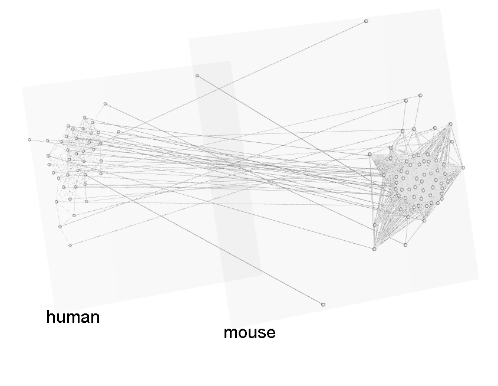

```{r setup, include=FALSE}
knitr::opts_chunk$set(echo = TRUE)
```

## Motivation

Visualization is important to modern data analysis. Network visualization provides first sight of network structure and topology. I wrote several pieaces of code before, and some has been used for previous publications. Now it is time to summarize a bit for frequent reference. 

There are many existing tools for visualization. But sometimes we just need basic graphs and want to modify a bit or embed it in our own way. Studying a comprehensive software needs more time than expected, not to mention installation or licence issue. Currently, my favourate package is [$\mathtt{igraph}$](http://igraph.org/r/), which allows us to conduct various network analysis in R, Python and C/C++. For visualization, it allows us to **customize** things with very little efforts. 

## Weighted network visualization by $\mathtt{igraph}$

Weighted network analysis is one of my main research topics. Commonly weighted network/graph means edges/links are weighted, but vertices/nodes can also have weights. The basic requirement for visualizing such network are:

 - 1. Edges weight should be expressed as edges width;
 - 2. Vertices weight shouls be expressed as vertices size;
 - 3. Edges should show direction if applicable;
 - 4. Vertices should be distinguished by colors if applicable;
 - 5. Labels (normally of vertices) should be attached in appropriate places;
 - 6. Nice (or not too bad) layouts or styles can be applied;
 - 7. Saved as vectorized graphics object for publication
  ...

Basic visualization may not include all these features, but should contain any if possible. Let us do it step by step. We have stored three variables for illustration, a gene symbol list `mgenes`, a node score vecor `z` and the Pearson correlation matrix `w` between them. The correlation matrix is computed by substracting the subset from the whole gene expression profile (GSE35103) and use `cor`, and the node score  is computed based on the expression level. This toy data is available at [toymodule.Rdata](toymodule.Rdata).

Here is the basic visualization with $\mathtt{igraph}$

```{r, message=FALSE, warning=FALSE}
load('toydata.Rdata')
tao <- 0.7 # threshold to cut-off correlation value. Higher tao means sparser.
diag(w) <- 0
w[w<tao] <- 0
require(igraph)
g <- graph_from_adjacency_matrix(w,mode='undirected',weighted=T)
plot(g)
```

It is a mass. Simply using `plot` leads to undesired results. We need to set the parametes with more careful consideration. If we add the requirement about edges width and vertices size, and try a specific layout,
```{r}
plot(g,layout=layout.reingold.tilford(g,circular=T),edge.width=(abs(w/max(w)))*5,vertex.size=10*abs((z/max(z))),vertex.label.dist = 0.5, vertex.label.cex = 0.75)
```
It looks better. Some of the parameters used for scalling the size need to be tuned further.

We can change the node color or highlight some of the nodes with different color by 
```{r}
V(g)$color="gray"
V(g)[which(V(g)$name=='RDX')]$color="red"
plot(g,layout=layout.reingold.tilford(g,circular=T),edge.width=(abs(w/max(w)))*5,vertex.size=10*abs((z/max(z))),
	vertex.label.dist = 0.5, vertex.label.cex = 0.75)
```

A few labels are overlapped, we may need to modify it by hand. $\mathtt{igraph}$ also provide a simpler way to interacte with graph, one can move vertices or edges on the graph for better layout.
```{r,eval=FALSE}
tkplot(g,layout=layout_with_fr,canvas.width = 1000, canvas.height = 800,
    edge.width=(abs(w/max(w)))*5,vertex.size=15*abs((z/max(z))),
    vertex.label.dist = 0.75, vertex.label.cex = 1)
```

Or save the whole picture as EPS format by the following code. 
```{r, message=FALSE, warning=FALSE}
setEPS()
postscript('toydata.eps',fonts=c("serif", "Palatino"))
plot(g,layout=layout_with_fr,edge.width=(abs(w/max(w)))*5,vertex.size=10*abs((z/max(z))),
	vertex.label.dist = 0.5, vertex.label.cex = 0.75)
dev.off()
```
## Multilayer network visualization by $\mathtt{MuxViz}$

Sometimes we need to plot multilayer network as a globle picture of multple networks and their interactions. [$\mathtt{MuxViz}$](http://muxviz.net/) provides such a platform. The following scripts work for multi-layer co-expression network, for preparing the input files [required](http://muxviz.net/tutorial.php) by $\mathtt{MuxViz}$.

```{r,eval=FALSE}
# write all node into filename
writeNode <- function(NamesAll,filename){
    write('nodeID nodeLabel',file=filename,append=TRUE)
    for (i in 1:length(NamesAll)){
        line = paste(i,NamesAll[i],sep=' ')
        write(line,file=filename,append=TRUE)}
}

# write the edge name of matrix W into filename, with layer id
writeEdgewithName <- function(W,filename,layerid){
    n = dim(W)[1]
    for (i in 1:(n-1)){
        for (j in (i+1):n){
            if(W[i,j]!=0){
                line = paste(colnames(W)[i],layerid,colnames(W)[j],
                             layerid,W[i,j],sep=' ')
                write(line,file=filename,append=TRUE)}
        }
    }
}

#  write inter-layer edge name of matrix W1 and W2, with layer ids
writeInterlayerEdgewithName <- function(W1,W2,filename,layerid1,layerid2){
	# sharednode = intersect(colnames(W1),toupper(colnames(W2)))
    sharednode = intersect(colnames(W1),colnames(W2))
    for (i in 1:length(sharednode)){
        j = which(colnames(W1)==sharednode[i])
        k = which(colnames(W2)==sharednode[i])
        line = paste(colnames(W1)[j],layerid1,colnames(W2)[k],layerid2,1,sep=' ')
        write(line,file=filename,append=TRUE)
    }
}
```

An example output:




## Interactive and Dynamic visualization 

I was just about to explore it from beginning but found [this](http://curleylab.psych.columbia.edu/netviz/). I don't think I could provide a better one. But Interactive and Dynamic visualization are really important for 1000 reasons.

## Endnote

This document is written in R Markdown. Want to write one like this? See [Writing reproducible reports in R ](https://nicercode.github.io/guides/reports/). Or more directly, the source of generating this page is available in [netvis.Rmd](https://github.com/fairmiracle/Short-Tutorials/blob/master/NetVis/netvis.Rmd).

## Find more

A more detailed and fundamental tutorial on Network visualization with R.  [link](http://kateto.net/network-visualization). An earlier version in [rpubs](https://rpubs.com/kateto/netviz).

A comprehensive collection of Network Visualization in R, focusing on *interactive* and *dynamic* aspects using fantastic tools. [link](http://curleylab.psych.columbia.edu/netviz/)

--
Last update: `r Sys.setlocale("LC_TIME", "English"); format(Sys.Date(), "%B %d, %Y")`