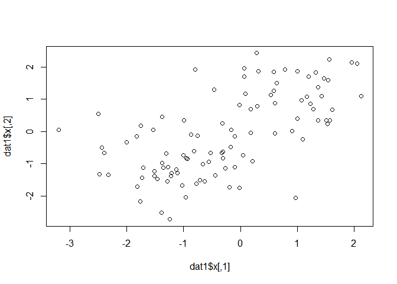
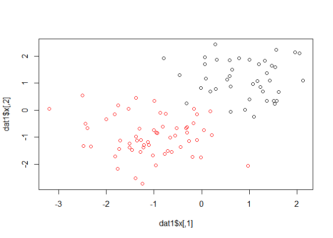
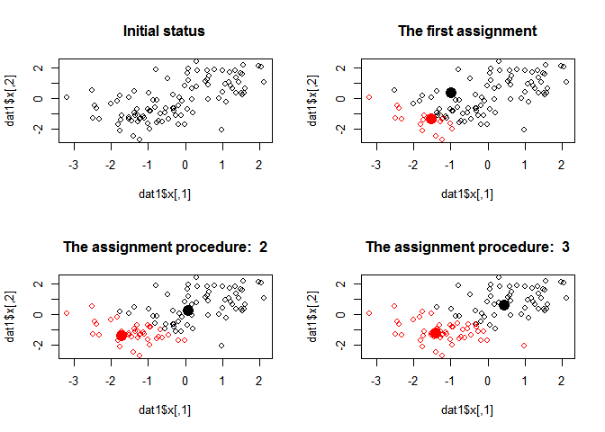
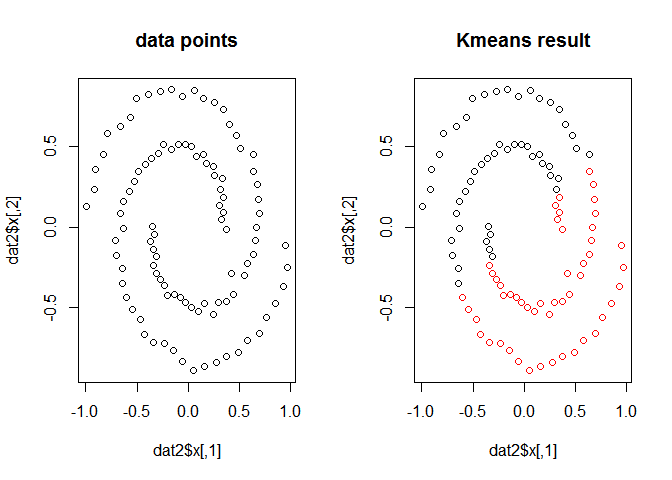
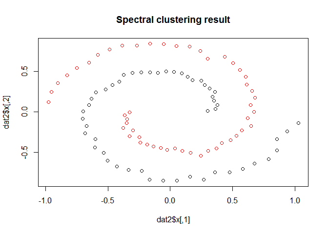
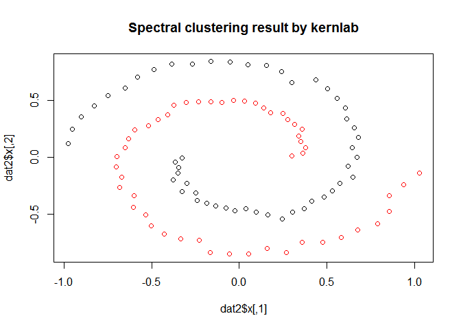

Motivation
----------

Recently we read a Nature
[paper](http://science.sciencemag.org/content/353/6295/163) which adopts
spectral clustering as the main method to find higher-order connectivity
patterns. The efficiency and scalability of their algorithm are
impressive. And We also found that the best player in this year's
[Disease Module Identification DREAM
Challenge](https://www.synapse.org/#!Synapse:syn6156761/wiki/400645)
uses spectral clustering as one of their main techniques to identify
modules, which achieved the best overall performance at all FDR levels.
Check their write-up: [A Double Spectral Approach to DREAM 11
Subchallenge
3](https://www.synapse.org/#!Synapse:syn7349492/wiki/407359).

As a classical clustering method, spectral techniques are still
promising. The basic questions remain as: what is spectral clustering
and why it works?

A starter dish about clustering
-------------------------------

Before we step into spectral clustering, let's look at a simple example
about clustering. Image we have a collection of two-dimensional data
points looks like,

    library(mlbench)
    n = 100
    k = 2
    dat1 = mlbench.2dnormals(n, cl=k, r=sqrt(k), sd=0.7)
    plot(dat1$x,col=rep(1,n))

How many clusters are their? It is easy for human to say

    plot(dat1$x,col=dat1$classes)

But how can we make the program know? We may need classical [K-means
algorithm](https://en.wikipedia.org/wiki/K-means_clustering). The idea
of k-means is quite straightforward:

-   1.  randomly picking *k* nodes as centroids,
-   1.  assign each data points to the centroids which is the most
        "close",
-   1.  calculated the new centroids based on previous assignment and
-   1.  repeat 2-3 until the centroids keep unchanged.

Code for 2) Assignment and 3) Update centroids:

    # Assign cluster labels given centroidids
    Assigment <- function(dat,centroidids){
        n <- dim(dat)[1]
        k <- dim(centroidids)[1]
        classes <- rep(1,n)

        for(i in 1:n){
            #mindist <- dist(rbind(dat[i,],centroidids[1]))
            mindist <- norm(as.matrix(dat[i,]-centroidids[1]), type="F")
            for(j in 2:k){
                currentdis = norm(as.matrix(dat[i,]-centroidids[j]), type="F")
                if( currentdis < mindist){
                    mindist = currentdis
                    classes[i] = j
                }
            }
        }
        classes
    }

    # Update centroidids given cluster labels
    Update <- function(dat,classes,k){
        l = dim(dat)[2]
        centroidids <- matrix(0, nrow=k,ncol=l)
        for(i in 1:k){
            centroidids[i,] =  colMeans(dat[which(classes==i),])
        }
        centroidids
    }

The basic k-means seems to work well in previous example. We can see the
procedure of how centroids move step by step:

But when the data points are not so straightforward (linearly
separable), such as spirals, where k-means may fail:

    dat2 <- mlbench.spirals(100,1,0.025)
    par(mfrow=c(1,2))
    plot(dat2$x)
    title('data points')

    #we call the system function kmeans this time
    km <- kmeans(dat2$x, centers=k)
    plot(dat2$x, col=km$cluster)
    title('Kmeans result')

We will see spectral clustering can work well here.

Spectral clustering algorithms
------------------------------

[Spectral clustering](https://en.wikipedia.org/wiki/Spectral_clustering)
makes use of spectrum(eigenvalues) of the similarity matrix to perform
data analysis. One simple form of the algorithm goes like

-   Make the affinity matrix *A* based on the similarity matrix
    *w**i**j* = *e**x**p*(−∥*s**i* − *s**j*∥2/2*σ*2)
    for *i* ≠ *j*.
-   Make the diagonal matrix *D* where
    *D**i**i* = ∑*j**A**i**j*, and the
    unnormalized Laplacian matrix *L* = *D* − *A* or normalized
    Laplacian matrix *L* = *D*−1/2*A**D*−1/2.
-   Find the first k eigenvectors
    *x*1, *x*2, ...*x**k* of L and form
    the new matrix
    *X* = \[*x*1*x*2...*x**k*\]∈ℝ*n* × *k*.
-   Conduct K-means on X.

Note that the affinity matrix is not always the similarity matrix W. For
some problem we need to consider the local neighborhood relationships.
k-nearest neighboor filter is a common choice:

And all these can be done in one line with package
[kernlab](https://cran.r-project.org/web/packages/kernlab).

    library(kernlab)
    skm=specc(dat2$x,centers=2)
    plot(dat2$x, col=skm)
    title('Spectral clustering result by kernlab')

Why spectral clustering works?
------------------------------

At the first sight you may feel amazing. Why it works? Why we pick
exactly *k* eigenvectors and why they are separable under this
representation? Following the logic of [Luxburg's
Tutorial](http://www.cs.cmu.edu/~aarti/Class/10701/readings/Luxburg06_TR.pdf),
the principle of explaining why Eigendecomposition can be used to do
clustering is to **establish an equivalence between Eigendecomposition
based procedure and clustering data points**. We only explore it from
the Graph cut perspective based on normalized Laplacian.

The essence of clustering is to separate data points based on their
similarities. Given the similarity graph (where nodes are data points
and edges are similarities) of these points, it aims to find a partition
that edges within the same cluster are dense and between different
clusters are sparse. This problem has been intensively studied in graph
theory.

Check [Cut](https://en.wikipedia.org/wiki/Cut_%28graph_theory%29) to
distinguish similar concepts of cut, cut-set and Minimum cut. Given the
adjacency matrix *W* of a graph *G* = (*V*, *E*), we define the
following metric for two disjoint subsets *A*, *B* ∈ *V*:
*c**u**t*(*A*, *B*)=∑*i* ∈ *A*, *j* ∈ *B**w**i**j*
 and $\\bar{A}$ as the
[complement](https://en.wikipedia.org/wiki/Complement_%28set_theory%29)
of *A*. For given *k* clusters, we want to find a partition
*A*1, *A*2, ...*A**k* that minimizes
$$Cut(A\_1,A\_2,...A\_k)=\\frac{1}{2}\\sum\_{i=1}^kcut(A\_i,\\bar{A\_i})$$
. But simply minizing this metric would lead to large clusters. Several
improvements were proposed and we mainly discuss normalized cut
[Ncut](https://people.eecs.berkeley.edu/~malik/papers/SM-ncut.pdf):
$$Ncut(A,B)=\\sum\_{i=1}^k\\frac{cut(A\_i,\\bar{A\_i})}{vol(A\_i)}$$
 where
*v**o**l*(*A*)=∑*i* ∈ *A*, *j**w**i*, *j* = ∑*i* ∈ *A**d**i*
and *d**i* is the connectivity (degree) of *i*.

Next we want to derive normalized spectral clustering as relaxation of
minimizing Ncut. Considering the simplest case When *k* = 2, there are
only *A* and $\\bar{A}$, we define the cluster indicator *f* (this is
the key idea) as
$$f\_i=\\left\\{
                \\begin{array}{ll}
                  \\sqrt{\\frac{vol(\\bar{A})}{vol(A)}}&if\\quad v\_i\\in A\\\\
                  -\\sqrt{\\frac{vol(A)}{vol(\\bar{A})}}&if\\quad v\_i\\in \\bar{A}
                \\end{array}
              \\right.$$

Note that $f^TD{\\bf 1}=0$. As we know
*D**i**i* = *d**i*, thus
$$\\begin{array}{ll}
\\sum\_if\_id\_i=\\sqrt{vol(\\bar{A})/vol(A)}\\sum\_{i\\in A}d\_i-\\sqrt{vol(A)/vol(\\bar{A})}\\sum\_{j\\in \\bar{A}}d\_j\\\\
=\\sqrt{vol(\\bar{A})/vol(A)}vol(A)-\\sqrt{vol(A)/vol(\\bar{A})}vol(\\bar{A})=0
\\end{array}$$
. And we also have *f*′*D**f* = *v**o**l*(*V*) since
$$\\begin{array}{ll}
f'Df=\\sum\_if\_i^2d\_i=\\sum\_{i\\in A}d\_i\\frac{vol(\\bar{A})}{vol(A)}+\\sum\_{i\\in \\bar{A}}d\_i\\frac{vol(A)}{vol(\\bar{A})}\\\\
=vol(\\bar{A})+vol(A)=vol(V)
\\end{array}$$

For every *f* we have
*f*′*L**f* = 1/2∑*i**j*(*f**i* − *f**j*)2,
and for the specific *f* defined above, we have
$$\\begin{array}{ll}
f'Lf=\\frac{1}{2}\\sum\_{i\\in A,j\\in \\bar{A}}w\_{ij}\\Big(\\sqrt{\\frac{vol(\\bar{A})}{vol(A)}}+\\sqrt{\\frac{vol(A)}{vol(\\bar{A})}}\\Big)^2+
\\frac{1}{2}\\sum\_{i\\in \\bar{A},j\\in A}w\_{ij}\\Big(-\\sqrt{\\frac{vol(A)}{vol(\\bar{A})}}-\\sqrt{\\frac{vol(\\bar{A})}{vol(A)}}\\Big)^2\\\\
=cut(A,\\bar{A})\\Big(\\frac{vol(A)}{vol(\\bar{A})}+\\frac{vol(\\bar{A})}{vol(A)}+2\\Big)\\\\
=cut(A,\\bar{A})\\Big(\\frac{vol(A)+vol(\\bar{A})}{vol(\\bar{A})}+\\frac{vol(\\bar{A})+vol(A)}{vol(A)}+2\\Big)\\\\
=vol(V)Ncut(A,\\bar{A})
\\end{array}$$

Because *v**o**l*(*V*) is constant for given graph, the equivalence
problem of minimize Ncut is to minimize *f*′*L**f* w.r.t *f*.
Unfortunately it is a discrete optimization problem.

If we relax the vector *f* to real number space we have the following
optimization problem
min*f* ∈ ℝ*n**f*′*L**f* *s*.*t*. *f**T**D* ⊥ 𝟙, *f*′*D**f* = *v**o**l*(*V*)

Furthermore we make *g* = *D*1/2*f*, the problem becomes
min*g* ∈ ℝ*n**g*′*L**s**y**m**g* *s*.*t*. *g* ⊥ *D*1/2𝟙, ∥*g*∥2 = *v**o**l*(*V*)
 where
*L**s**y**m* = *D*−1/2*L**D*−1/2.
According to [Rayleigh
quotient](https://en.wikipedia.org/wiki/Rayleigh_quotient), the solution
is given by the second eigenvector of *L**s**y**m*. That
means as long as we get *f* by eigenvector of *L**s**y**m*,
we get a partition which make minimize Ncut thus get the clusters. Refer
to [Luxburg's
Tutorial](http://www.cs.cmu.edu/~aarti/Class/10701/readings/Luxburg06_TR.pdf)
when *k* &gt; 2.

References
----------

This document is written in R Markdown. Want to write one like this? See
[Writing reproducible reports in
R](https://nicercode.github.io/guides/reports/).

A close topic was given by João Neto at [Spectral
Clustering](http://www.di.fc.ul.pt/~jpn/r/spectralclustering/spectralclustering.html).

A nice tutorial of spectral clustering was given by Luxburg at [A
Tutorial on Spectral
Clustering](http://www.cs.cmu.edu/~aarti/Class/10701/readings/Luxburg06_TR.pdf).

A popular Chinese machine learning blog by pluskid also contains
[spectral clustering](http://blog.pluskid.org/?p=287).
